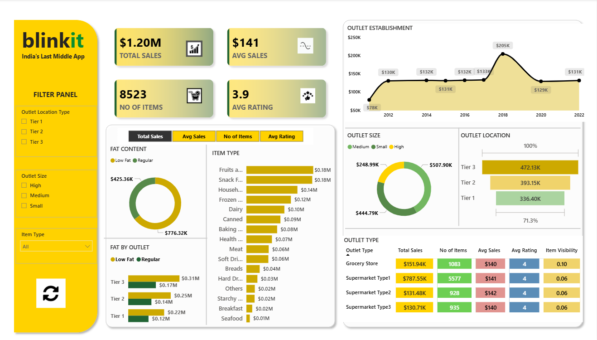

# Blinkit Sales Dashboard — Power BI

Practice project built following a YouTube tutorial to learn Power BI dashboard design.

**Tools:** Power BI · DAX · Data Visualization

---

## Dashboard preview

---

## Key metrics

| Metric | Value |
|--------|-------|
| Total Sales | $1.20M |
| Avg Sales | $141 |
| No of Items | 8,523 |
| Avg Rating | 3.9 |

---

## Analysis covered

- Fat content analysis (Low Fat vs Regular)
- Sales by item type
- Fat content by outlet tier
- Outlet establishment trend (2012–2022)
- Outlet size and location breakdown
- Outlet type performance summary

---

## Key insights

- Regular fat items lead with $776.32K vs Low Fat $425.36K
- Fruits and Snack Foods are the top item types at $0.18M each
- Tier 3 outlets generate highest sales at $472.13K
- Sales peaked in 2018 at $205K — declining trend post 2018
- Supermarket Type1 dominates with $787.55K total sales

---

