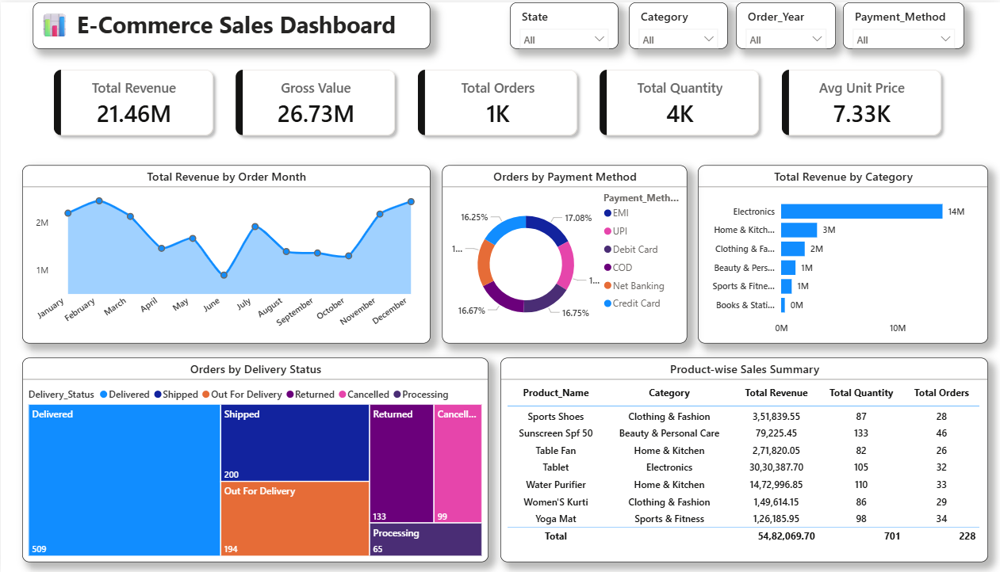

# E-Commerce Sales Dashboard — Power BI

Practice project built following a YouTube tutorial to learn Power BI dashboard design.

**Tools:** Power BI · DAX · Data Visualization

---

## Dashboard preview

---

## Key metrics

| Metric | Value |
|--------|-------|
| Total Revenue | 21.46M |
| Gross Value | 26.73M |
| Total Orders | 1K |
| Total Quantity | 4K |
| Avg Unit Price | 7.33K |

---

## Analysis covered

- Total revenue by order month
- Orders by payment method
- Total revenue by category
- Orders by delivery status
- Product-wise sales summary

---

## Key insights

- Electronics leads revenue at 14M — 65%+ of total category sales
- EMI and UPI are the top payment methods
- 509 orders delivered successfully out of 1K total orders
- Tablet is the highest revenue product at ₹30,30,387

---

