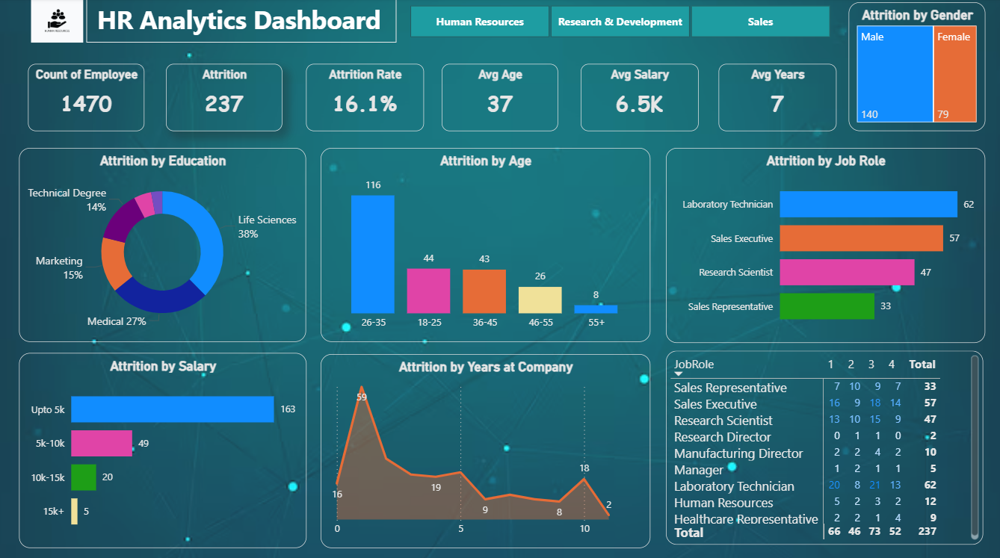

# HR Analytics Dashboard — Power BI

Practice project built following a YouTube tutorial to learn Power BI dashboard design.

**Tools:** Power BI · DAX · Data Visualization

---

## Dashboard preview

---

## Key metrics

| Metric | Value |
|--------|-------|
| Total Employees | 1,470 |
| Attrition Count | 237 |
| Attrition Rate | 16.1% |
| Avg Age | 37 |
| Avg Salary | 6.5K |
| Avg Years | 7 |

---

## Analysis covered

- Attrition by education field
- Attrition by age group
- Attrition by job role
- Attrition by salary slab
- Attrition by years at company
- Attrition by gender

---

## Key insights

- Life Sciences education has highest attrition at 38%
- Age group 26–35 shows highest attrition at 116 employees
- Laboratory Technician is the most at-risk job role with 62 attritions
- Employees earning up to 5K salary show highest attrition at 163
- Attrition spikes at year 1 — early tenure retention is critical

---

