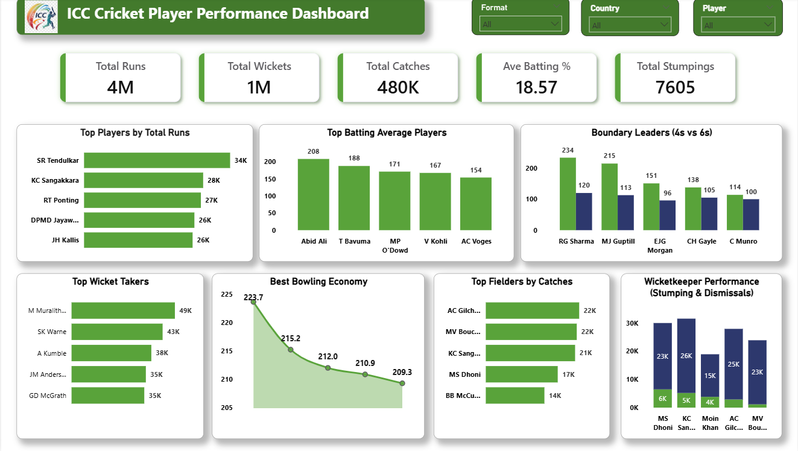

# ICC Cricket Player Performance Dashboard — Power BI

Practice project built following a YouTube tutorial to learn Power BI dashboard design.

**Tools:** Power BI · DAX · Data Visualization

---

## Dashboard preview

---

## Key metrics

| Metric | Value |
|--------|-------|
| Total Runs | 4M |
| Total Wickets | 1M |
| Total Catches | 480K |
| Avg Batting % | 18.57 |
| Total Stumpings | 7,605 |

---

## Analysis covered

- Top players by total runs
- Top batting average players
- Boundary leaders (4s vs 6s)
- Top wicket takers
- Best bowling economy
- Top fielders by catches
- Wicketkeeper performance (stumping & dismissals)

---

## Key insights

- SR Tendulkar leads total runs at 34K — highest among all players
- M Muralitharan tops wicket takers at 49K
- RG Sharma leads boundary count with 234 fours
- AC Gilchrist and MV Boucher top fielders with 22K catches each
- Abid Ali leads batting average at 208

---

